# Aplicación web para el sistema de tracking de la cadena de suministro del café basado en la tecnología blockchain

- Este proyecto corresponde a la interfaz web del tracking de tracking descrito [aquí](https://github.com/NathaliaBarreiros/coffee-supply-chain-tracking-system-ethereum).
- La aplicación web permite que los usuarios puedan interactuar con los contratos alojados en la blockchain.
- La aplicación creada se llama CoffeeTrack y emplea [React](https://es.reactjs.org/) como librería de desarrollo y [Ethers.js](https://docs.ethers.io/v5/) como librería para interactuar con el ecosistema de la cadena de bloques de Ethereum.

## Despliegue de la aplicación web

---

### Requisitos previos para correr el proyecto

---

- Sistema Operativo: Linux Ubuntu 20.04 LTS +
- Nodejs: v16.15.0
- Git: v2.26.2
- Yarn: v1.22.19

### Configuración para el despliegue

---

1. Realizar una bifurcación del proyecto a través de la URL https://github.com/NathaliaBarreiros/coffee-supply-chainclient, utilizando una cuenta personal de GitHub. Esto debido a que el alojamiento de la aplicación web en el servicio Vercel se lo realiza a través de un repositorio propio del proyecto.

2. A continuación, clonar localmente el repositorio que se bifurcó en la cuenta personal y acceder a la carpeta del proyecto [/client](https://github.com/NathaliaBarreiros/coffee-supply-chain-client/tree/main/client).

```
git clone https://github.com/NombreUsuarioGitHub/coffee-supply-chain-client.git
cd client
```

3. Establecer las variables de entorno del proyecto. Para esto se crea un archivo .env en la carpeta raíz del proyecto (`/client`), se copia el contenido del archivo [.env.example](https://github.com/NathaliaBarreiros/coffee-supply-chain-client/blob/main/client/.env.example) y se configuran las variables de entorno de manera personalizada.

4. Instalar los paquetes del proyecto con el siguiente comando:

```
yarn add https://github.com/NombreUsuarioGitHub/coffee-supply-chain-client.git
```

5. En el archivo [App.js](https://github.com/NathaliaBarreiros/coffee-supply-chain-client/blob/main/client/src/App.js) de la carpeta `/src` dentro de `/client`, reemplazar las direcciones de
   los contratos inteligentes `CoffeeSupplyChain.sol`, `CoffeeSupplyChain2.sol` y `SupplyChainUser.sol`, por las direcciones obtenidas en el despliegue de los contratos, obtenidos [aquí](https://github.com/NathaliaBarreiros/coffee-supply-chain-tracking-system-ethereum). Estos valores se encuentran desde la línea 88 a la línea 90 del archivo
   `App.js`, los reemplazos deberían realizarse como sigue:

```
const userAddress = 'dirección_contrato_SupplyChainUser.sol';
const coffeAddress1 = 'dirección_contrato_CoffeeSupplyChain.sol';
const coffeAddress2 = 'dirección_contrato_CoffeeSupplyChain2.sol';
```

6. Para hacer pública la implementación de la aplicación web usar el servicio de [Vercel](https://vercel.com/dashboard).

- Se puede probar la aplicación web de manera local a través del comando `yarn start`, lo que abre la URL `http://localhost:3000/` en el navegador web.

### Modificaciones

---

- Si se realizan cambios en los [contratos inteligentes](https://github.com/NathaliaBarreiros/coffee-supply-chain-tracking-system-ethereum/tree/main/contracts), se debe actualizar el código de la aplicación web.

- Sobre todo, se deben actualizar los archivos ABI de los contratos inteligentes presentes en el directorio [/client/src/contracts](https://github.com/NathaliaBarreiros/coffee-supply-chain-client/tree/main/client/src/contracts). Los archivos a modificar serían: [`CoffeeSupplyChain1.json`](https://github.com/NathaliaBarreiros/coffee-supply-chain-client/blob/main/client/src/contracts/CoffeeSupplyChain1.json), [`CoffeeSupplyChain2.json`](https://github.com/NathaliaBarreiros/coffee-supply-chain-client/blob/main/client/src/contracts/CoffeeSupplyChain2.json), [`SupplyChainUser1.sol`](https://github.com/NathaliaBarreiros/coffee-supply-chain-client/blob/main/client/src/contracts/SupplyChainUser1.json). Para esto se debe copiar el objeto abi de los contratos correspondientes, que son producto de la
  compilación de estos, los cuales se encuentran en la carpeta `/build/contracts` del [backend del sistema de tracking](https://github.com/NathaliaBarreiros/coffee-supply-chain-tracking-system-ethereum).

- Al realizar cambios en el repositorio local de la aplicación web, ya sea al actualizar la dirección de los contratos, cambiar el ABI de estos o cualquier otro cambio, se debe actualizar y subir los cambios en el repositorio remoto de GitHub a través de los comandos
  siguientes:

```
git add .
git commit –m “Comentario”
git push dirección_SSH_repositorio_GitHub
```

### Pantallas de la aplicación web

---

Para utlizar la aplicación web a través de la URL de [CoffeeTrack](https://coffeetrack.vercel.app/home), se debe tener instalada la extensión de [MetaMask](https://metamask.io/download/) en el navegador web y habilitar la testnet de [Goerli](https://umbria.network/connect/ethereum-testnet-goerli).

#### Página Inicio

---

<p align="center">
  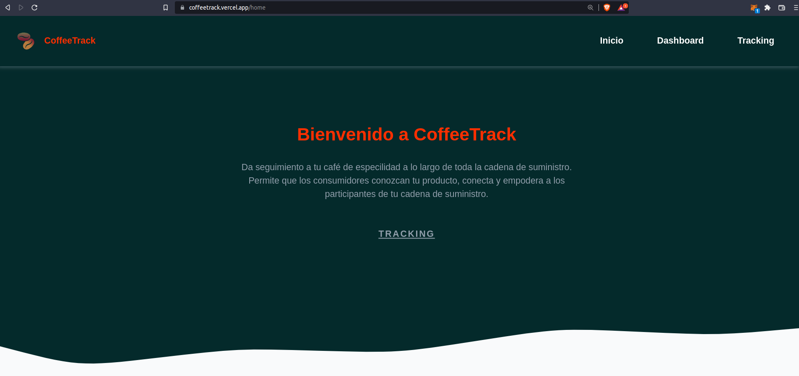
</p>

<p align="center">
  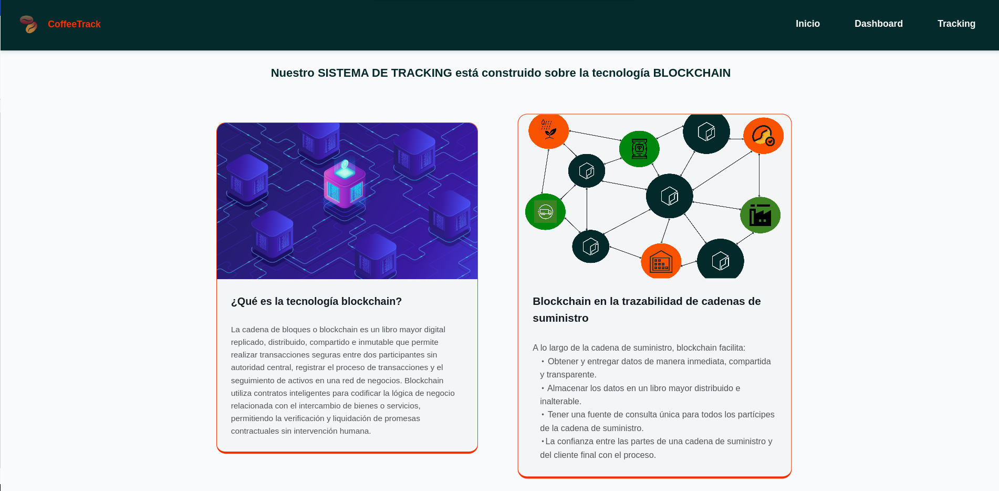
</p>

<p align="center">
  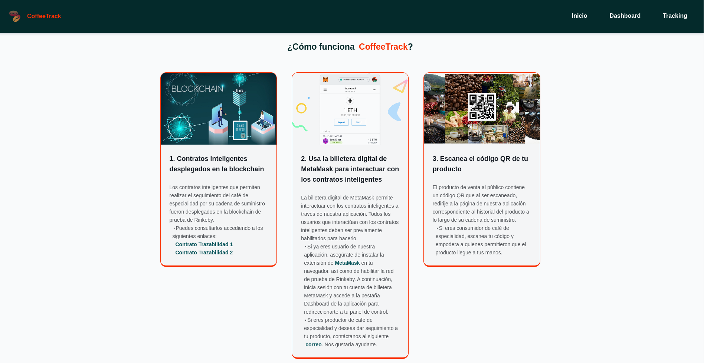
</p>

<p align="center">
  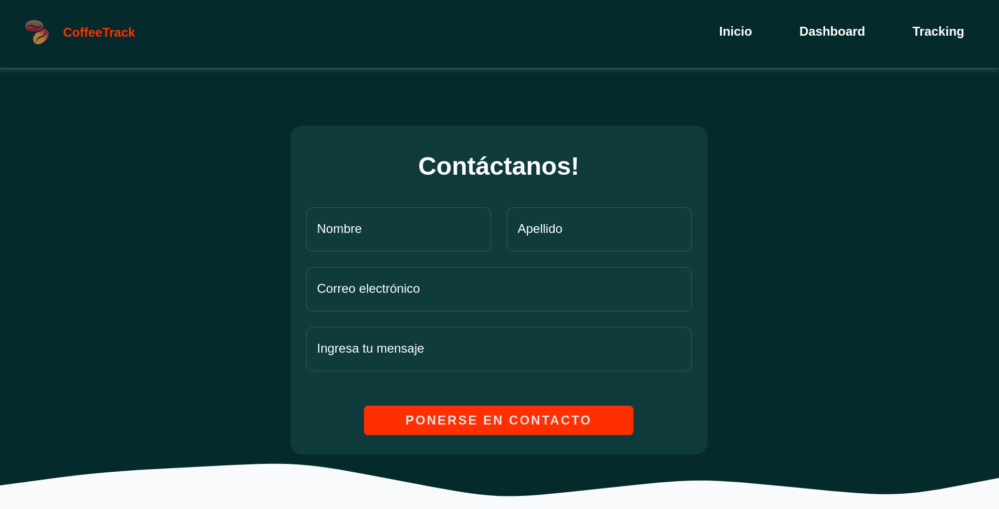
</p>

#### Página Login

---

<p align="center">
  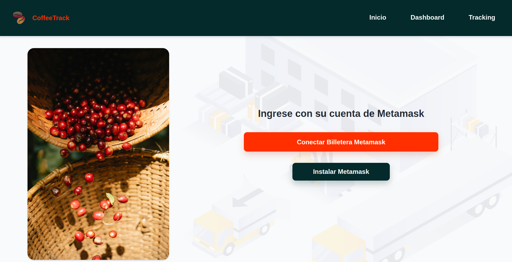
</p>

#### Página Dashboard

---

##### Rol de Administrador

---

- Panel de control del Administrador

---

<p align="center">
  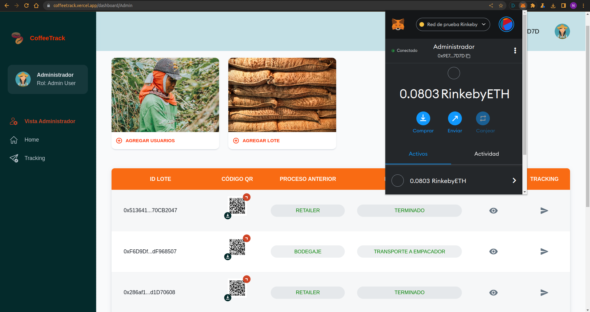
</p>

- Formulario para agregar usuarios en el sistema

---

<p align="center">
  
</p>

- Formulario para ingresar un lote de café en el sistema

---

<p align="center">
  
</p>

- Tabla de los lotes de café creados en el sistema

---

<p align="center">
  
</p>

- Opción para ampliar la imagen de un código QR específico e imagen
  descargada

---

<p align="center">
  
</p>

- Línea de tiempo de los procesos y sus estados para un lote café específico

---

<p align="center">
  
</p>

##### Rol de Agricultor

---

- Panel de control del Agricultor

---

<p align="center">
  
</p>

- Formulario para actualizar perfil del usuario Agricultor

---

<p align="center">
  
</p>

- Formulario para agregar datos de cosecha

---

<p align="center">
  
</p>

- Ventana emergente de la opción AGREGAR COSECHA CON CÓDIGO QR

---

<p align="center">
  
</p>

##### Rol de Procesador

---

- Panel de control de un usuario Procesador

---

<p align="center">
  
</p>

- Formulario para agregar datos de procesado

---

<p align="center">
  
</p>
<p align="center">
  
</p>

##### Rol de Catador

---

- Panel de control de un usuario Catador

---

<p align="center">
  
</p>

- Formulario para agregar datos de catación

---

<p align="center">
  
</p>

##### Rol de Vendedor de Café

---

- Panel de control de un usuario Vendedor de Café

---

<p align="center">
  
</p>

- Formulario para agregar datos de venta de café

---

<p align="center">
  
</p>

##### Rol de Bodega

---

- Panel de control de un usuario con rol de Bodega

---

<p align="center">
  
</p>

- Formulario para agregar datos de bodegaje

---

<p align="center">
  
</p>

##### Rol de Transportista a Empacador

---

- Panel de control de un usuario Transportista a Empacador

---

<p align="center">
  
</p>

- Formulario para agregar datos de transporte a empacador

---

<p align="center">
  
</p>

##### Rol de Empacador

---

- Panel de control de un usuario Empacador

---

<p align="center">
  
</p>

- Formulario para agregar datos de empacado

---

<p align="center">
  
</p>

##### Rol de Transportista a Retailer

---

- Panel de control de un usuario Transportista a Retailer

---

<p align="center">
  
</p>

- Formulario para agregar datos de transporte a retailer

---

<p align="center">
  
</p>

##### Rol de Retailer

---

- Panel de control de un usuario con rol de Retailer

---

<p align="center">
  
</p>

- Formulario para agregar datos de comercialización en retailer

---

<p align="center">
  
</p>
<p align="center">
  
</p>

#### Página Tracking

---

<p align="center">
  
</p>

- Opción LOTE DE EJEMPLO

---

Se puede acceder a la página de un [lote ejemplo](https://coffeetrack.vercel.app/tracking?batch=0x68c37dD00940BEb553BC8ADc1071a4568fEDC793).

<p align="center">
  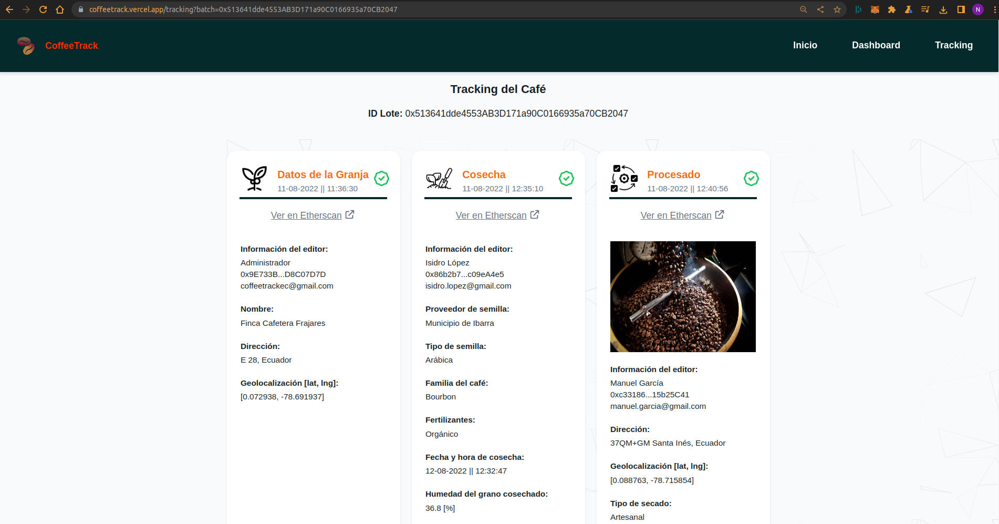
</p>
<p align="center">
  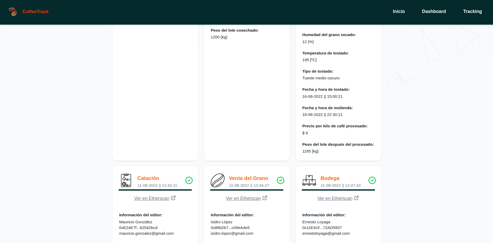
</p>
<p align="center">
  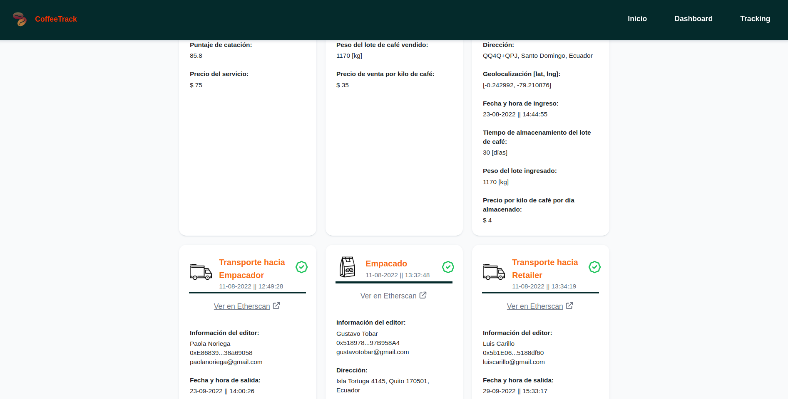
</p>
<p align="center">
  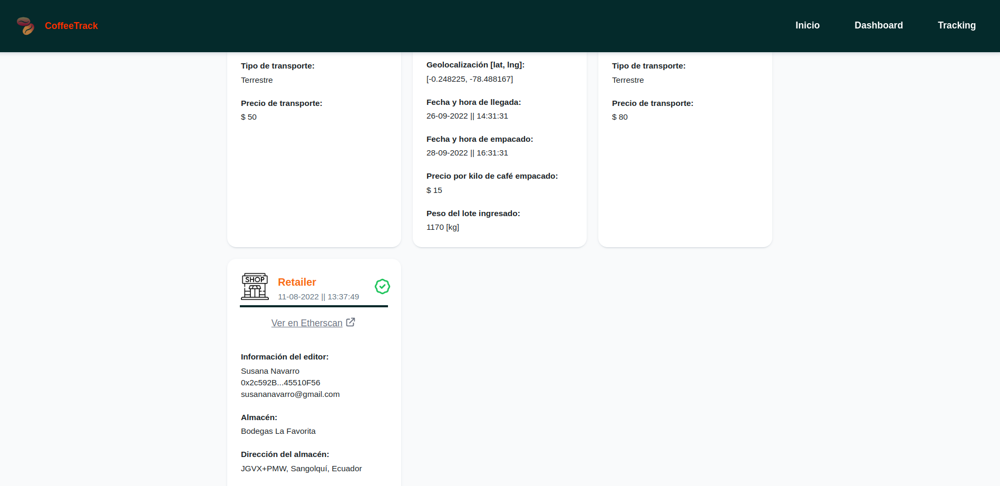
</p>
<p align="center">
  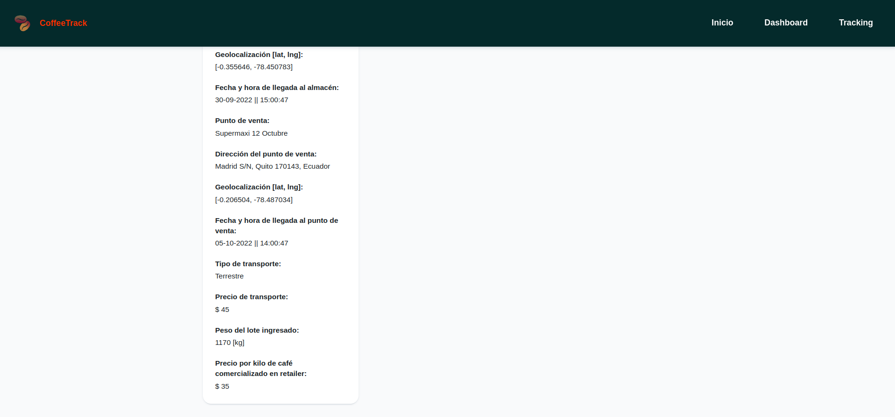
</p>
<p align="center">
  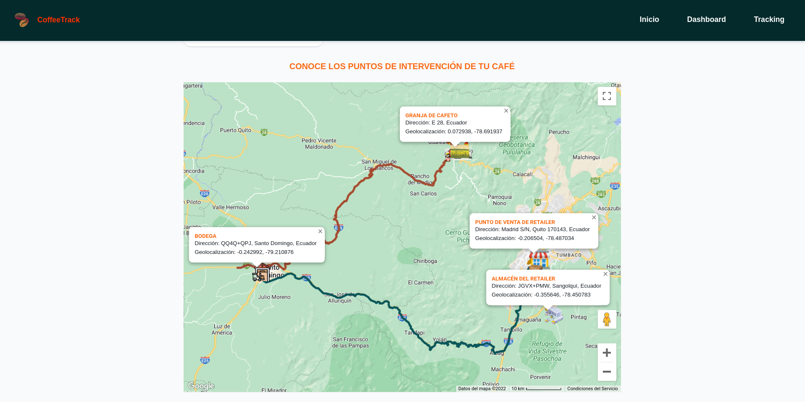
</p>

- Opción ESCANEAR QR

---

<p align="center">
  
</p>
